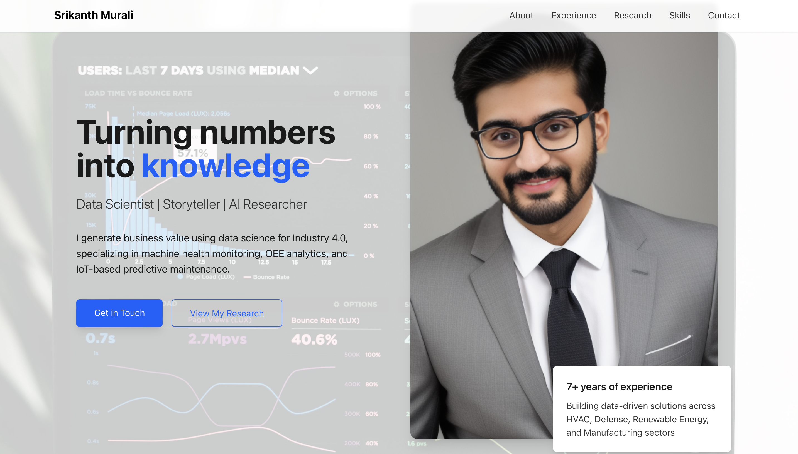

# VisualPortfolio

A dynamic and responsive visual portfolio web application developed using Replit's AI-assisted coding environment.

## 🚀 Features

- **Responsive Design**: Ensures optimal viewing across devices.
- **AI-Enhanced Development**: Leveraged Replit's AI tools for efficient coding.
- **Modular Architecture**: Organized codebase for scalability and maintenance.

## 🛠️ Technologies Used

- **Frontend**: HTML, CSS, JavaScript
- **Backend**: [Specify if applicable, e.g., Node.js, Python]
- **Deployment**: [Specify if deployed, e.g., Replit, Netlify]

## 📸 Screenshots




## 📚 Getting Started

1. **Clone the repository**:
   ```bash
   git clone https://github.com/srikanthmurali/VisualPortfolio.git

2. Navigate to the project directory:
   
   cd VisualPortfolio

3. Install dependencies:

   npm install
   
4. Run the application:

   npm start

## 🤝 Contributing

Contributions are welcome! Please fork the repository and submit a pull request for any enhancements or bug fixes.

## 📄 License

This project is licensed under the MIT License.


